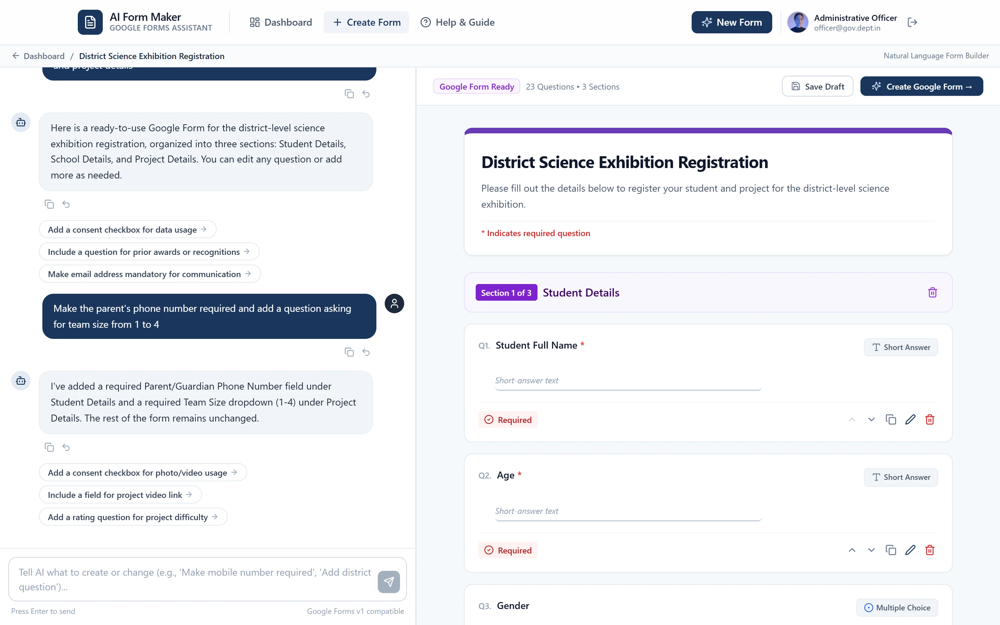

# My AI Form Maker 🚀

**Describe your form. Publish it to Google Forms.**

My AI Form Maker is a production-ready web app that lets administrative staff, government officers, and educators design and publish structured Google Forms through natural conversation — no form-building experience needed.



---

## 🌟 Key Features

1. **Natural Language Form Design** — Describe your form requirements in plain English (or your own language).
2. **Intelligent Clarification** — The AI asks 1–2 focused questions with clickable suggestion chips to refine sections and questions.
3. **Real-time Live Preview** — Google Forms–style preview with inline title edits, reordering, duplicate, delete, and a question settings editor.
4. **Natural Language Modifications** — Change forms on the fly (e.g. *"Make mobile number mandatory"*, *"Add district question"*, *"Remove gender"*).
5. **Direct Google Forms Publishing** — Creates real Google Forms in your own Google Drive, with responder and edit links.
6. **Update Without Breaking Links** — Re-publish changes to an existing form; the share link stays the same and no duplicates are created.
7. **Dashboard** — Keep editing drafts, reopen published forms, and manage everything in one place.
8. **Undo & Custom Confirmation Messages** — Undo AI changes and write your own post-submission message.
9. **Government & Admin Friendly UI** — Calm, high-trust design with zero technical jargon, fully responsive on mobile.

---

## 🛠️ Tech Stack

| Layer | Technology |
| --- | --- |
| Frontend | Next.js 14 (App Router), TypeScript, Tailwind CSS |
| Authentication | Firebase Authentication (Google OAuth with `forms.body` & `drive.file` scopes) |
| Database | Firebase Cloud Firestore (with local browser storage fallback) |
| AI Engine | Groq API (`openai/gpt-oss-120b`, `openai/gpt-oss-20b`, `qwen/qwen3.8-27b`) with Zod-validated structured output |
| Google Integration | Google Forms API v1, Google Drive API v3 |
| Icons | Lucide React |

---

## 📁 Project Structure

```
app/
  api/groq/generate/        AI form generation endpoint
  api/google/create-form/   Publishes / updates forms via the Google Forms API
  create/                   Form builder (chat + live preview)
  dashboard/                Saved and published forms
  forms/[id]/               Form details
  help/ whats-new/          User guide and changelog
  privacy/ terms/           Legal pages
  manifest.ts robots.ts sitemap.ts
components/                 Navbar, Footer, form-builder UI
lib/
  site.ts                   App name, description, URL, brand colours
  firebase/ google/ groq/   Service integrations
  validation/               Zod form schema
public/                     Favicon, app icons, Open Graph image, screenshots
```

---

## 🚀 Quick Start

### 1. Install dependencies
```bash
npm install
```

### 2. Configure environment variables
```bash
cp .env.example .env.local
```

| Variable | Description |
| --- | --- |
| `GROQ_API_KEY` | Groq API key from [console.groq.com](https://console.groq.com) |
| `NEXT_PUBLIC_FIREBASE_*` | Firebase web app config (Firebase Console → Project Settings) |
| `FIREBASE_PROJECT_ID`, `FIREBASE_CLIENT_EMAIL`, `FIREBASE_PRIVATE_KEY` | Firebase Admin SDK service account (server-side) |
| `GOOGLE_CLIENT_ID`, `GOOGLE_CLIENT_SECRET` | Google Cloud OAuth credentials |
| `NEXT_PUBLIC_APP_URL` | Public URL of the app (e.g. `https://yourdomain.com`) — used for SEO, sitemap, and share previews |

### 3. Run the development server
```bash
npm run dev
```

Open [http://localhost:3000](http://localhost:3000) in your browser.

---

## 🌐 Deploying to Production

1. Set all environment variables above in your hosting provider — **especially `NEXT_PUBLIC_APP_URL`** set to your live domain.
2. In Google Cloud Console, add your production domain to the OAuth client's authorised JavaScript origins and redirect URIs, and enable the Google Forms and Google Drive APIs.
3. In Firebase Console → Authentication → Settings, add your domain to **Authorised domains**.
4. Deploy Firestore security rules:
   ```bash
   firebase deploy --only firestore:rules
   ```
5. Build and start:
   ```bash
   npm run build && npm start
   ```

The app ships production-ready out of the box:

- **Branding** — SVG/ICO favicon, Apple touch icon, and installable PWA icons (including maskable).
- **SEO & sharing** — Per-page titles, meta descriptions, Open Graph/Twitter cards with a 1200×630 preview image, `robots.txt`, and `sitemap.xml`. Private pages (dashboard, builder, form details) are `noindex`.
- **Security headers** — HSTS, `X-Content-Type-Options`, `X-Frame-Options`, `Referrer-Policy`, `Permissions-Policy`, and a COOP policy compatible with Google sign-in popups. `X-Powered-By` is disabled.
- **Custom 404 page.**

To change the app name, description, or theme colour, edit [`lib/site.ts`](lib/site.ts).

---

## 🧪 Scripts

| Command | Description |
| --- | --- |
| `npm run dev` | Build Tailwind CSS and start the dev server |
| `npm run build` | Production build |
| `npm start` | Serve the production build |
| `npm run lint` | Lint the codebase |

---

## 🔒 Privacy

My AI Form Maker only requests permission to create and manage the Google Forms and Drive files it creates. It never reads your other Drive files or email, and form responses go straight to your Google account. See the in-app [Privacy Policy](app/privacy/page.tsx) and [Terms of Service](app/terms/page.tsx).
